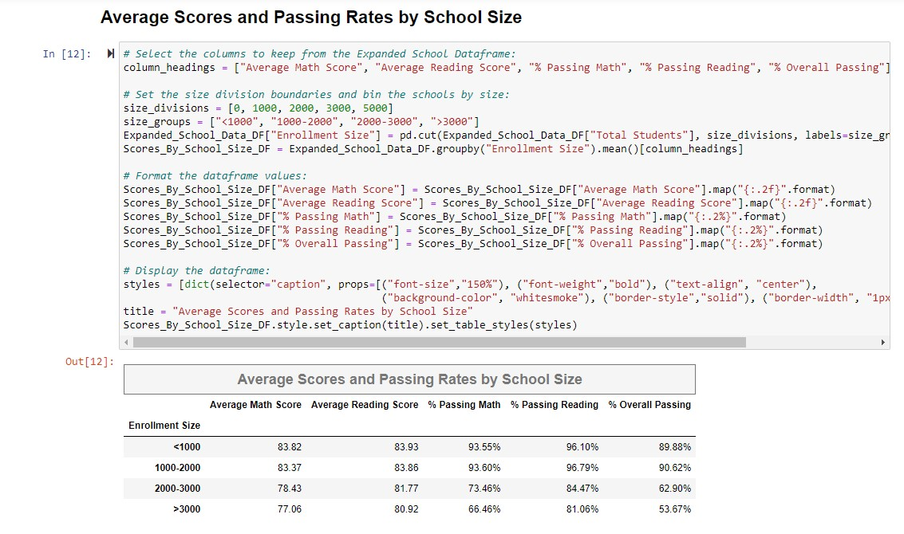

<h1> Py City Schools   (Using Python and Pandas to analyze academic performance in a fictitious school district) </h1>

This Jupyter notebook (PyCitySchools.ipynb) demonstrates several ways to use Pandas data frames to analyze student academic
performance in the fictitious Py City School District.  Specifically, does a school's size, budget, or type (charter or district)
have any influence on it's students' math and reading scores.
The input data comes from csv files "schools_complete.csv" and "students_complete.csv". 
There is not an output data file, but all output is contained within the notebook and appears below each corresponding code cell.

To examine the source code files and data files, their locations are indicated in the tree below:

#### Folders/Files:

> **"PyCitySchools"** (main folder)  
> - *"PyCitySchools.ipynb"* (jupyter notebook file containing python/pandas code)  
> - **"Resources"** (subfolder)  
>	- *"schools_complete.csv"* (input data file)  
>	- *"students_complete.csv"* (input data file)  
	
(Please do not move, rename, delete, or alter!)

#### Snippets of Source Code:  
 
  
  
  
