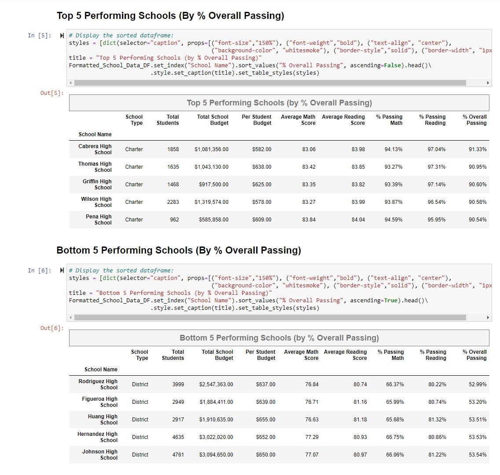
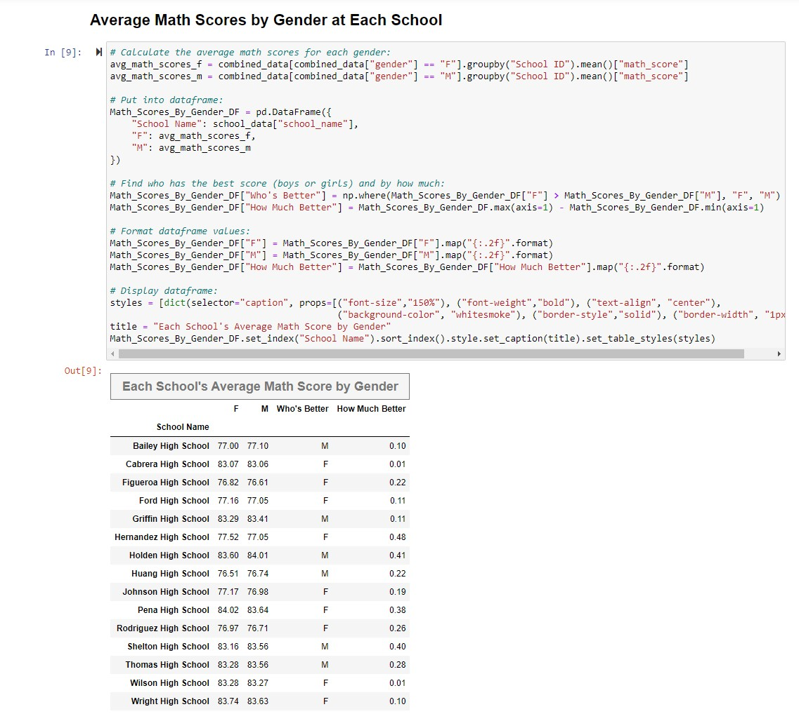

<h1> Heroes of Pymoli   (Using Python and Pandas to analyze data for a fictitious game) </h1>

This Jupyter notebook (HeroesOfPymoli.ipynb) demonstrates several ways to use Pandas data frames to analyze age, gender, and spending patterns
for the fictitious game Heroes of Pymoli. The input data comes from csv file "purchase_data.csv". 
There is not an output data file, but all output is contained within the notebook and appears below each corresponding code cell.

To examine the source code files and data files, their locations are indicated in the tree below:

#### Folders/Files:

> **"HeroesOfPymoli"** (main folder)  
> - *"HeroesOfPymoli.ipynb"* (jupyter notebook file containing python/pandas code)  
> - **"Resources"** (subfolder)  
>	- *"purchase_data.csv"* (input data file)  
	
(Please do not move, rename, delete, or alter!)

#### Snippets of Source Code:  
 
  
  
